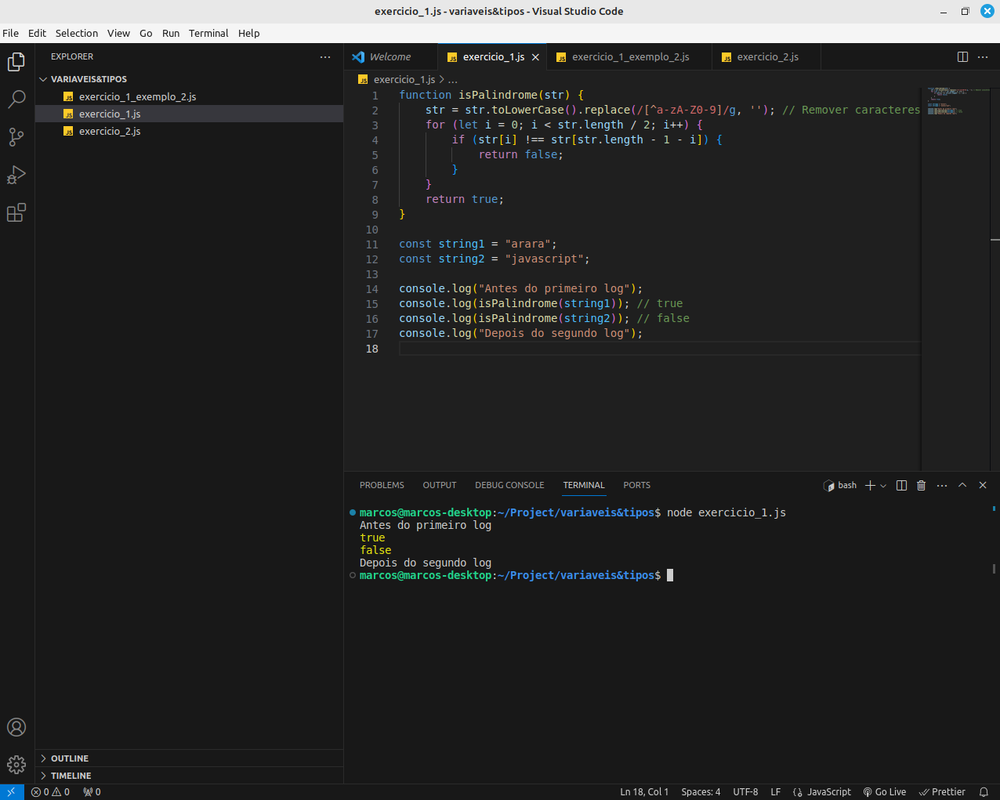
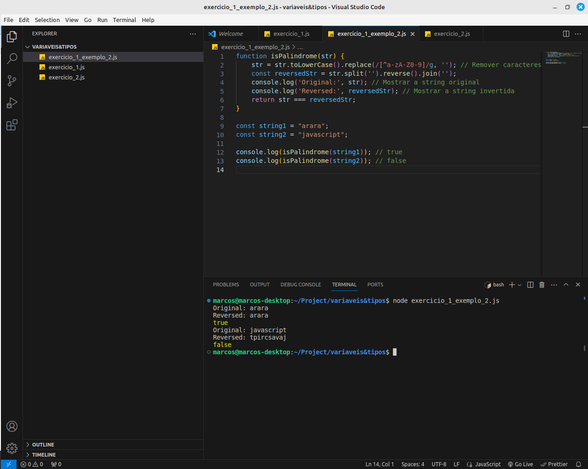
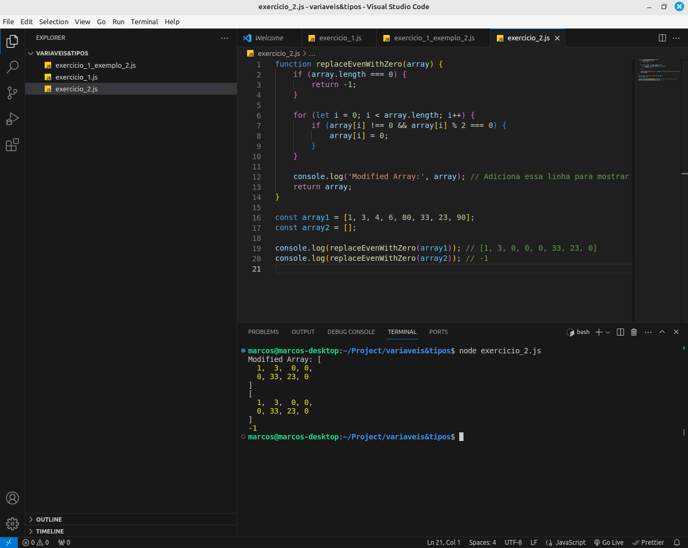

# Variaveis e Tipos

Atividade 1 - Verifique, de duas maneiras diferentes entre si, se uma string é um pallíndromo.
Palindromo: frase ou palavra que se pode ler, indiferentemente, da esquerda para direita ou vice-versa.

Atividade 2 Troque todos os elementos pares e diferentes de zero de uma array pelo número 0. Se o array for vazio, retorne -1.
Exemplo  Input -> [1,3,4,6,80,33,23,90] Output ->[1,3,0,0,0,33,23,0]  Input -> [ ]  Output -> -1

